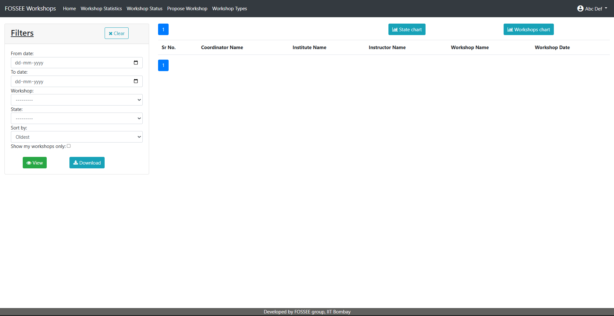
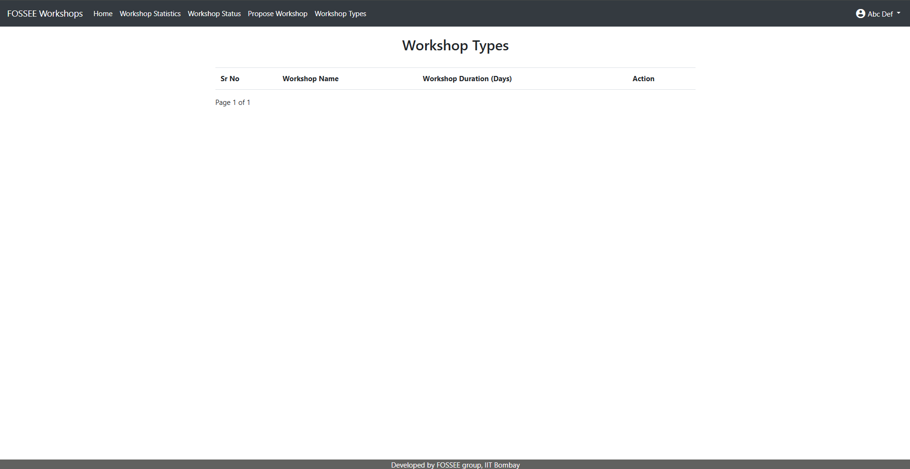
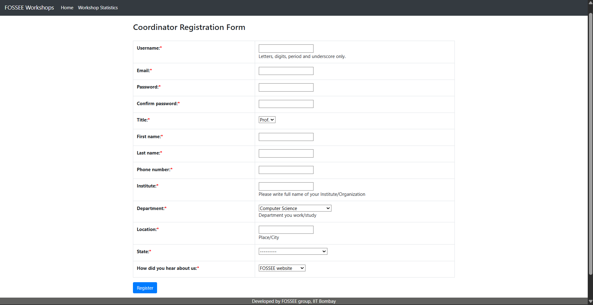
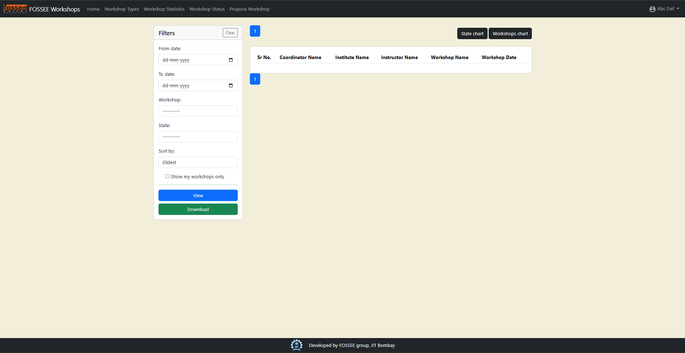
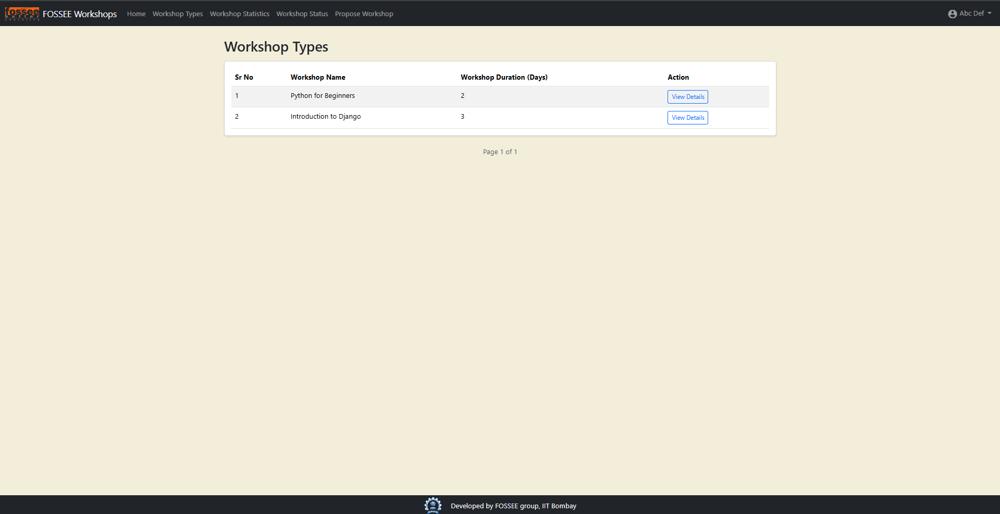
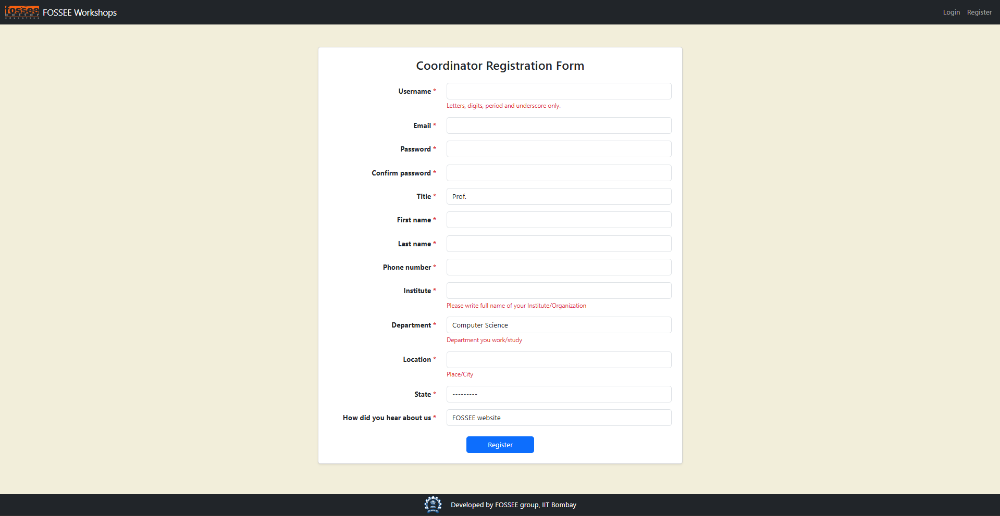

# FOSSEE UI/UX Enhancement Task 1 Submission

This repository contains the completed submission for the FOSSEE Semester Long Internship Python Screening Task 1. The goal was to take an existing Django web application and improve its user interface and user experience, with a focus on creating a clean, responsive, and professional design.

---

## Setup and Installation

To run this project locally, please follow these steps. Python 3.8 is required.

1.  **Clone the repository:**
    ```bash
    git clone https://github.com/saina25/fossee-python-task1.git
    cd fossee-python-task1
    ```

2.  **Create and activate a virtual environment:**
    ```bash
    # On Windows
    py -3.8 -m venv venv
    .\venv\Scripts\activate

    # On Mac/Linux
    python3.8 -m venv venv
    source venv/bin/activate
    ```

3.  **Install the dependencies:**
    ```bash
    pip install -r requirements.txt
    ```

4.  **Set up the database:**
    ```bash
    python manage.py makemigrations cms
    python manage.py migrate
    ```

5.  **Create a superuser (for admin access):**
    ```bash
    python manage.py createsuperuser
    ```

6.  **Run the development server:**
    ```bash
    python manage.py runserver
    ```
    The application will be available at `http://127.0.0.1:8000/`.

---

## Visual Showcase

This section includes before-and-after comparisons to highlight the UI/UX improvements.

### Before





### After





---

## Reasoning (Required)

#### What design principles guided your improvements?

My improvements were guided by three core design principles:
1.  **Mobile-First Design:** The primary goal was to ensure the application is fully usable and readable on small screens. This guided the implementation of a responsive navbar and fluid form/table layouts that stack vertically on mobile devices.
2.  **Consistency:** I integrated the Bootstrap 5 framework to create a consistent and predictable design language across all pages, including buttons, forms, tables, and typography. This makes the user experience predictable and intuitive.
3.  **Visual Hierarchy:** I used components like Bootstrap `card`s, a subtle off-white background, and deliberate spacing (padding and margins) to group related content and guide the user's eye, making the interface easier to scan and understand.

#### How did you ensure responsiveness across devices?

Responsiveness was achieved primarily by leveraging the Bootstrap 5 framework:
-   **Responsive Navbar:** The site-wide navigation bar was rebuilt using `navbar-expand-lg`, which automatically collapses it into a functional hamburger menu on mobile and tablet screens.
-   **Grid System:** Page layouts, especially for forms like the registration page, were structured using Bootstrap's responsive grid (`row`, `col-md-*`). This allows a two-column layout on desktops to gracefully stack into a single, user-friendly column on smaller devices.
-   **Fluid Components:** Standard Bootstrap components like buttons, tables, and form controls are inherently responsive, ensuring they adapt to the available screen width.

#### What trade-offs did you make between the design and performance?

The primary trade-off was adding an external framework (Bootstrap 5) via a CDN. This introduces a small network request for the CSS and JS files, which can slightly increase the initial page load time. However, this trade-off is overwhelmingly positive, as the framework provides a massive and immediate improvement in user experience, accessibility, and responsiveness, and significantly sped up development time.

#### What was the most challenging part of the task and how did you approach it?

The most challenging part was the initial setup of the local development environment. The project's older dependencies were incompatible with modern Python versions, leading to critical errors (like the missing `distutils` and `cgi` modules). I approached this systematically by:
1.  **Debugging** each error to understand its root cause.
2.  **Researching** the issue and determining it was a fundamental version incompatibility.
3.  **Implementing** the correct solution, which was to install a compatible version of Python (3.8) and create a new, clean virtual environment with it.
This methodical problem-solving was a crucial first step before any UI/UX improvements could be made.
